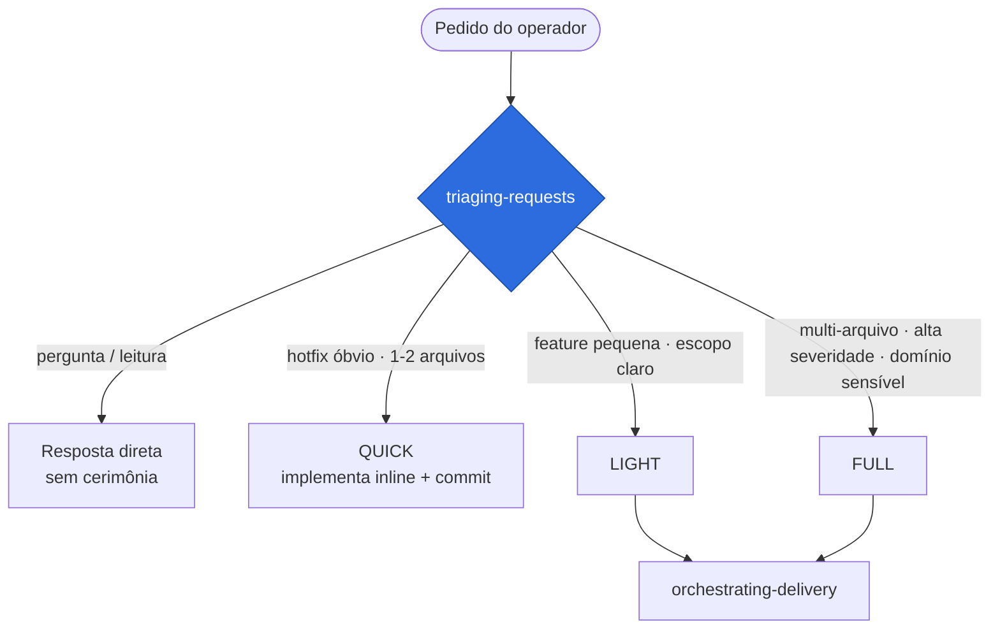
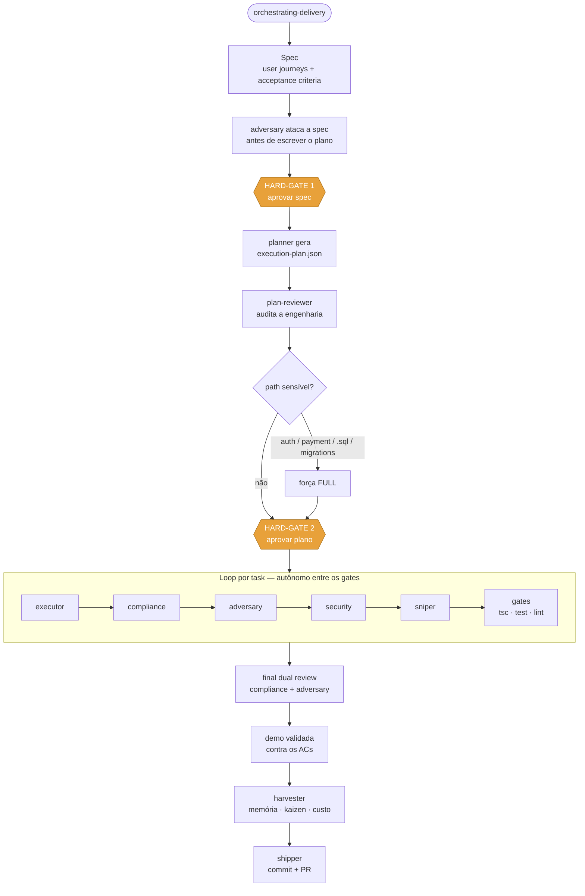
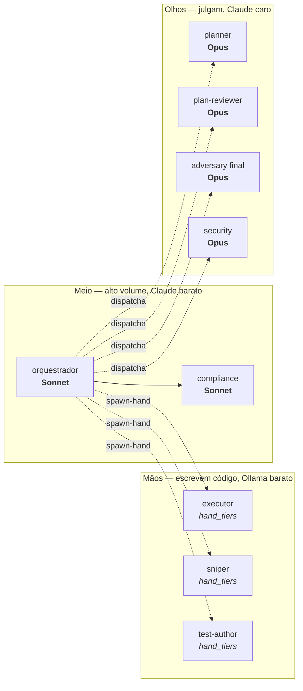
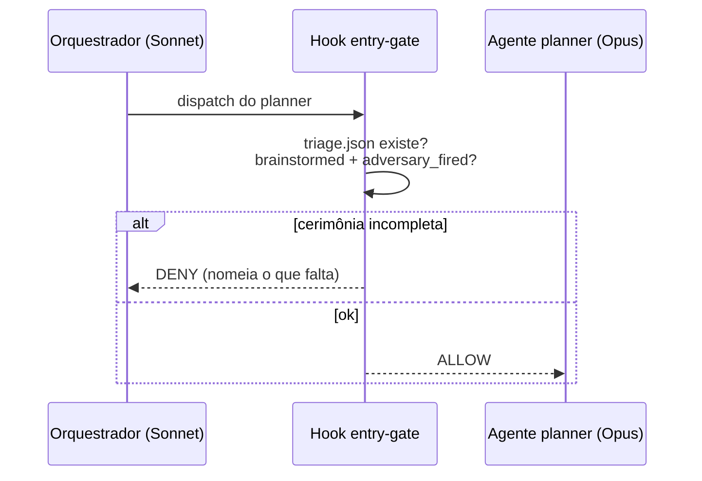
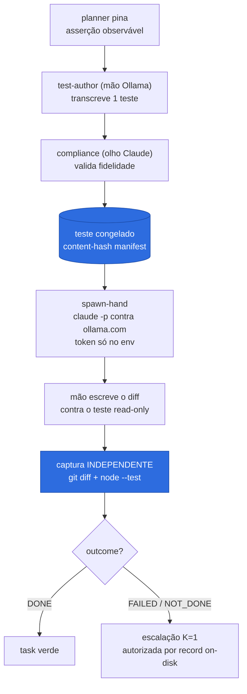
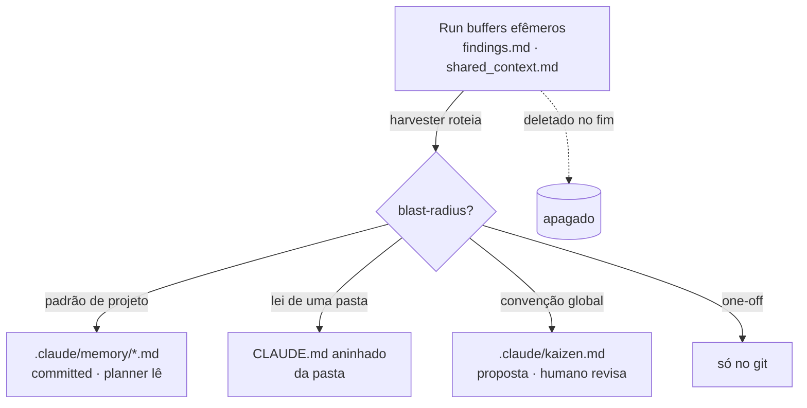

# Claude Harness

  

Um framework de uso do **Claude Code** para **não desenvolvedores** (product managers, founders, operadores) entregarem software com pipeline de qualidade — sem precisar julgar arquitetura, segurança ou tradeoffs de baixo nível.

A ideia central: o humano toma **decisões de produto** (o que construir, aceitar/recusar risco); o sistema resolve a **engenharia** (como construir, testar, revisar) dentro de um loop de agentes especializados.

> **Filosofia barbell:** orquestração barata no alto volume, raciocínio caro só nas pontas. Um orquestrador **Sonnet** coordena e delega ao **Opus** apenas nos gates de fronteira. Mais fundo ainda: as **mãos que escrevem código** (executor, sniper, test-author) rodam em modelos **Ollama baratos**, enquanto os **olhos que julgam** (planner, compliance, adversary, security) ficam em Claude — *strong eyes, cheap hands*. O que mantém isso seguro não é confiar no modelo barato — são **trilhos determinísticos** (hooks, guards, plano resolvido, teste congelado, captura independente) que carregam o julgamento crítico.

---

## Como uma tarefa flui

Toda interação passa primeiro pela **triagem**, que roteia para um de quatro caminhos:



Para **LIGHT** e **FULL**, o orquestrador roda a pipeline completa de entrega:



Os três **HARD-GATES** humanos — aprovar spec, aprovar plano, testar demo — são as únicas decisões pedidas ao operador, sempre em linguagem de produto. O loop entre eles é totalmente autônomo.

---

## Roteamento de modelos (barbell)

O orquestrador é o maior consumidor de tokens → é onde está a economia. Mais fundo, as **mãos** rodam fora do Claude (Ollama barato); os **olhos** Claude entram só nos pontos certos, por override no dispatch:



| Papel | Modelo | Por quê |
|---|---|---|
| **orquestrador** (main loop) | **Sonnet** | maior volume de tokens → a economia real |
| executor / sniper / test-author | **mão Ollama** (`hand_tiers`) | escrevem código — barato, contido pelo trilho determinístico |
| compliance | Sonnet | spec-vs-implementação |
| planner | Opus | raciocínio nível arquitetura |
| plan-reviewer (gate inicial) | Opus | audita o plano antes da execução |
| adversary (por task) | Opus | já forte; sobe `effort` antes de subir tier |
| adversary (gate final) | Opus | última fronteira antes da entrega |
| security | Opus | auditor condicional |

> As mãos resolvem o modelo de `hand_tiers` no dispatch (ladder cravado `glm-5.1` → `deepseek-v4-pro` → `kimi-k2.7-code`). Um alias Claude pode ser posto direto num tier para uma task sensível. Os **olhos** são sempre Claude — não-negociável. A economia vem das mãos baratas no alto volume de escrita; o Opus nas pontas é **investimento de qualidade**, não economia.

---

## Trilho determinístico de entrada

Como o orquestrador é um modelo barato, as decisões críticas **não** ficam a cargo do julgamento dele — são travadas por hooks do Claude Code. O `entry-gate` bloqueia o dispatch de agentes de entrega sem a cerimônia cumprida:



Outros trilhos: o guard `<PLANNER-ONLY>` impede o orquestrador de gerar o plano inline (força o dispatch do `planner` Opus); o override de path sensível é um check de glob; o roteamento de modelo é uma tabela fixa. **Quanto mais barato o orquestrador, mais os trilhos carregam o julgamento.**

---

## Strong eyes, cheap hands

As mãos que escrevem código rodam num modelo **Ollama barato**, fora da subscription Claude. O que torna isso seguro não é confiar na mão — é nunca acreditar na prosa dela. Cada task é um par **freeze → impl** com captura independente:



O que carrega a segurança:

- **Teste congelado antes da implementação.** O `planner` pina uma asserção observável, a mão `test-author` a transcreve, um olho Claude (`compliance`) valida a fidelidade, e o teste é congelado por content-hash. A mão de implementação escreve contra um teste **read-only** que não pode tocar.
- **Captura independente é o gate de registro.** O resultado da task não vem da prosa da mão — o harness reconstrói o diff via `git diff --name-only <freeze_sha>` ∪ `git ls-files --others` e roda `node --test` por conta própria (com guard anti-verde-vazio). Escopo, manifest congelado e teste verde são verificados pelo harness, não relatados pelo modelo.
- **Escape on-disk não-forjável.** Uma escalação para uma mão Claude (K=1) só é liberada quando existe um **run-record on-disk** — escrito pela captura independente — cujo `outcome` é uma run genuína não-`DONE`, ancorada ao `freeze_commit_sha`. Um ticket forjado por `echo` não autoriza nada.
- **Token nunca vaza.** O auth do Ollama vive só no env do processo filho (`~/.claude/.dev.vars`, resolvido uma vez), nunca em argv/brief/settings; redação on-disk; fail-close se vazar no descriptor.

> Provado ao vivo: uma mão `qwen3-coder-next` autorou um diff in-scope e o teste congelado ficou verde na captura independente (`outcome DONE`) — sem gastar um token da subscription na escrita.

---

## Dois modos de execução

A pipeline é a mesma; muda **quem ocupa os pontos de decisão humana**.

| | **Local** (interativo) | **Headless** (routine na nuvem) |
|---|---|---|
| Quem está no loop | o operador, em tempo real | ninguém — roda sozinho |
| Decisões humanas | gates ao vivo (aprovar spec/plano/demo) | simuladas por agentes; o gate real é a **revisão do PR** |
| Entrega | merge com OK do operador | abre **PR draft** pra revisão assíncrona |
| Onde roda | máquina do operador (`~/.claude`) | cloud routine, lendo o `.claude/` commitado no repo |

O modo headless **não substitui** o local — é uma variante autônoma da mesma pipeline, ativada pela instrução no prompt da routine.

---

## Memória e conhecimento

O harness usa stores nativos, repo-relativos (pra a nuvem enxergar). Ao fim de cada entrega, o `harvester` roteia o aprendizado durável por **blast-radius**:



`kaizen.md` é uma **caixa de saída** de propostas de melhoria do próprio harness — nunca auto-aplicadas; o humano revisa e promove. Memória e kaizen são commitados (nunca segredos/PII).

---

## Medidor de custo

No fim de cada entrega, o `harvester` reporta — em linguagem de produto — o **custo da sessão** (equivalente-API, breakdown por modelo) e a **tendência semanal de consumo** do Claude Code, via [ccusage](https://ccusage.com) sobre o transcript local. O semanal abrange todos os projetos: é um proxy real de consumo, **não % da subscription** (que é opaca). Fail-soft quando ccusage não está acessível.

---

## Estrutura

```
core/                 # núcleo distribuível → vai pro .claude/ do projeto
  agents/             # agentes de delivery (planner, executor, adversary, …)
  skills/             # skills da pipeline (triaging, orchestrating, …)
    orchestrating-delivery/references/   # runners da mão barata
                      #   spawn-hand · dispatch-hand · capture-hand (Ollama)
  rules/              # rules universais (git, security, code-quality, architecture, …)
  hooks/              # trilhos determinísticos (entry-gate, plan-write-gate, …)
  CLAUDE.md           # entry-policy genérica (zero dado pessoal)
  settings.json       # permissões mínimas, sem flags perigosas
  memory/             # memória repo-relative
modules/              # add-ons opt-in (rtk, mv) — nunca dependência do core
docs/                 # o estudo: constraints da nuvem, auditoria, desenho
```

**Estado em disco por run:**

```
.claude/plans/
  .state/<session_id>/      # efêmero: gate-state.json, triage.json (oculto)
  <feature_id>/             # durável: execution-plan.json, shared_context.md
```

---

## Como usar

Ver **[`docs/usage.md`](docs/usage.md)** — instalar/atualizar o harness num projeto (`vendor-core`), o padrão de issues (`harness-ready`), configurar a routine no Claude Code, e setar o modelo do orquestrador.

Para o desenho e as decisões: [`docs/design.md`](docs/design.md) · [`docs/cloud-routines.md`](docs/cloud-routines.md) · [`docs/audit.md`](docs/audit.md).

---

## Status

Em evolução ativa. Versionado por marco (ver [`CHANGELOG.md`](CHANGELOG.md) e os releases). Núcleo da pipeline, trilho determinístico de entrada, mão barata Ollama com captura independente (*strong eyes, cheap hands*) e medidor de custo já operacionais.
