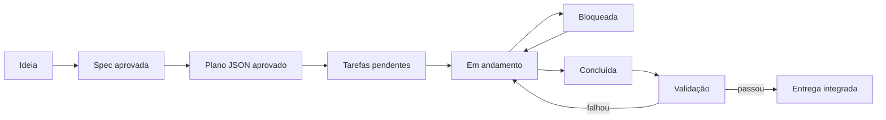
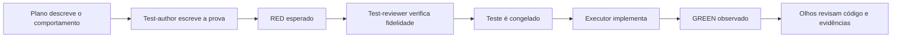
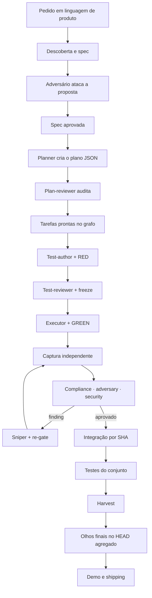
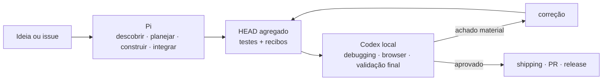

# Claude Harness — da ideia a uma entrega verificável

 <!-- x-release-please-version -->   

Eu criei este harness a partir de um problema que parece simples.

Você pede uma funcionalidade para uma IA. Ela escreve centenas de linhas, roda alguns comandos e diz: “pronto”. O resultado parece convincente. Mas como saber se ela construiu o que você pediu — e não apenas algo que se parece com o que você pediu?

Para quem não é desenvolvedor, essa pergunta é especialmente difícil. A pessoa consegue avaliar o produto: dizer o que precisa acontecer, o que ficou bom e qual risco aceita. Mas não deveria precisar julgar sozinha arquitetura, segurança, concorrência, cobertura de testes ou um diff enorme.

O Claude Harness nasceu para preencher esse espaço. Ele não é outro modelo de IA. É um **sistema de entrega ao redor dos modelos**: transforma uma ideia em decisões explícitas, distribui o trabalho entre agentes especializados e exige evidências antes de chamar alguma coisa de pronta.

> O humano decide **o que vale construir**. O harness organiza **como construir, verificar, corrigir e entregar**.

## O problema escondido no “faz isso pra mim”

Uma conversa única com um agente mistura funções que deveriam estar separadas.

O mesmo agente entende o pedido, escolhe a solução, escreve os testes, implementa o código e avalia se o próprio trabalho ficou bom. É como pedir ao autor de uma prova que escreva as perguntas, responda e dê a própria nota.

Isso cria alguns modos de falha recorrentes:

- a implementação começa antes de o problema estar realmente entendido;
- decisões importantes ficam enterradas na conversa e somem depois;
- o teste é adaptado ao código, em vez de proteger o comportamento desejado;
- quem construiu tende a validar a própria interpretação;
- um “deu tudo certo” em texto vira substituto para evidência real;
- modelos caros gastam tempo com tarefas mecânicas, enquanto decisões críticas recebem atenção insuficiente;
- quando várias tarefas rodam juntas, ninguém sabe com precisão qual resultado pertence a qual versão do código.

A primeira resposta do harness foi simples: **parar de tratar um único agente como uma equipe inteira**.

## Uma pequena equipe de agentes

No harness, cada agente tem um papel limitado. Alguns escrevem. Outros só observam e julgam. O agente que implementa não pode simplesmente declarar que a implementação está correta e encerrar o trabalho.

Essa separação é a base do conceito **olhos fortes, mãos econômicas** — ou, de forma mais memorável, **olhos caros e mãos baratas**.

### Mãos fazem o trabalho

As mãos são os agentes que modificam arquivos:

- o **test-author** transforma critérios aprovados em testes executáveis;
- o **executor** faz a menor implementação capaz de atender a tarefa;
- o **sniper** corrige um achado específico sem reabrir todo o escopo;
- o **shipper** realiza a operação final autorizada de entrega sobre uma série já revisada.

Como essas tarefas têm limites claros, elas podem usar modelos mais econômicos. O objetivo não é confiar cegamente num modelo barato. É dar a ele uma missão pequena, um escopo explícito e uma prova que outra parte do sistema vai verificar.

### Olhos julgam o trabalho

Os olhos são agentes de leitura e revisão:

- o **planner** decide como decompor a solução;
- o **plan-reviewer** procura falhas no plano antes de qualquer implementação;
- o **test-reviewer** verifica se os testes representam o comportamento aprovado;
- o **compliance** compara o resultado com spec, plano e evidências;
- o **adversary** tenta quebrar premissas e encontrar riscos escondidos;
- o **security** procura problemas de autorização, secrets, injection e fronteiras inseguras;
- o **harvester** separa aprendizado reutilizável de ruído temporário.

Os olhos recebem mais capacidade justamente nos pontos onde uma decisão errada se multiplica. Um erro do executor costuma ficar dentro de uma tarefa. Um erro do planner pode contaminar todas elas.

“Caro” aqui significa **atenção proporcional à importância da decisão**. Nem todo revisor precisa do maior modelo disponível em toda chamada. O roteamento combina papel, complexidade e esforço de raciocínio, e fica congelado no plano para não mudar oportunisticamente no meio da entrega.

## Mas como essa equipe concorda sobre o que está acontecendo?

Separar os papéis resolve o conflito de interesse, mas cria outro problema: agentes diferentes precisam trabalhar sobre o mesmo contrato.

Uma conversa em linguagem natural não basta. Ela é ótima para descobrir o produto, mas é ambígua demais para controlar uma entrega longa. Por isso o harness transforma as decisões aprovadas em dois artefatos:

1. uma **spec**, escrita para humanos, explica o resultado desejado, jornadas, critérios e limites;
2. um **plano JSON**, legível por máquina, transforma essa intenção em tarefas, dependências, escopos, testes e revisões verificáveis.

É aqui que entra a state machine.

## O plano JSON como state machine da entrega

Pense no plano como a ficha de uma encomenda passando por uma cozinha profissional. Ela diz quais pratos existem, o que cada estação pode tocar, o que precisa ficar pronto antes de outra etapa e como conferir o resultado.

O plano não tenta guardar o “pensamento” do agente. Ele guarda **estado observável**.


```mermaid
flowchart LR
    I[Ideia] --> S[Spec aprovada]
    S --> P[Plano JSON aprovado]
    P --> R[Tarefas pendentes]
    R --> W[Em andamento]
    W --> B[Bloqueada]
    B --> W
    W --> C[Concluída]
    C --> V[Validação]
    V -->|falhou| W
    V -->|passou| D[Entrega integrada]
```

Na prática existem três camadas relacionadas, cada uma com uma responsabilidade diferente:

- **`execution-plan.json`** é o contrato congelado: define o que pode acontecer;
- **`harness_plan`** é o painel de progresso: mostra `pending`, `in_progress`, `completed` ou `blocked` e o estado de validação;
- **o registry de tarefas do Pi** é a autoridade operacional: registra sessões, worktrees, tentativas, resultados e integrações.

Essa distinção importa. O painel não aprova nada, e o plano não finge que uma tarefa terminou. A execução só avança quando o estado operacional apresenta as evidências esperadas.

### Por que usar uma máquina de estados?

Sem estado explícito, o agente pode pular uma etapa e compensar com uma explicação convincente. Com a máquina de estados, cada passagem tem uma condição concreta:

- não existe implementação LIGHT/FULL sem spec e plano atuais;
- não existe executor antes do teste e da revisão de fidelidade, quando a tarefa exige teste;
- não existe integração de uma task sem captura, revisões e um HEAD exato;
- uma correção devolve a tarefa para `in_progress` e invalida apenas o que aquela mudança tornou velho;
- não existe shipping se o HEAD atual não for o mesmo que os olhos revisaram.

O benefício principal não é burocracia. É **retomada confiável**. Se a sessão cair ou for aberta no dia seguinte, o sistema não precisa acreditar num resumo de memória: ele consegue ler o que foi aprovado, o que está pendente e quais provas ainda correspondem ao código atual.

### Um exemplo reduzido

```json
{
  "feature_id": "checkout-com-cupom",
  "mode": "full",
  "model_strategy": {
    "hand_tiers": {
      "low": "openai-codex/gpt-5.6-luna",
      "medium": "openai-codex/gpt-5.6-terra",
      "high": "openai-codex/gpt-5.6-terra"
    },
    "planner": "openai-codex/gpt-5.6-sol",
    "plan-reviewer": "openai-codex/gpt-6-astra",
    "compliance": "openai-codex/gpt-5.6-terra",
    "adversary": "openai-codex/gpt-5.6-sol",
    "security": "openai-codex/gpt-5.6-sol",
    "harvester": "openai-codex/gpt-5.6-luna",
    "shipper": "openai-codex/gpt-5.6-luna"
  },
  "tasks": [
    {
      "id": "validar-cupom",
      "title": "Validar cupom no checkout",
      "description": "Aplicar somente cupons ativos e dentro da validade.",
      "depends_on": [],
      "severity": "medium",
      "complexity": "medium",
      "scope_paths": ["src/checkout", "test/checkout/coupon.test.ts"],
      "resolved_judgments": {
        "expired_coupon_behavior": "return-expired-error"
      },
      "criterion_refs": ["#ac-cupom-expirado"],
      "locked_tests": [
        {
          "id": "lt-rejeita-cupom-expirado",
          "path": "test/checkout/coupon.test.ts",
          "assertion": "Given um cupom expirado, When o checkout valida o pedido, Then retorna o erro coupon_expired sem aplicar desconto",
          "fixture_paths": ["test/fixtures/expired-coupon.json"]
        }
      ],
      "adversarial": {
        "enabled": false,
        "focus": []
      }
    }
  ],
  "final_review": {
    "compliance": true,
    "adversary": true,
    "security": false
  },
  "demo": {
    "type": "smoke",
    "scenarios_from_refs": ["#uj-aplicar-cupom"]
  }
}
```

Mesmo sem conhecer JSON, dá para ler a intenção: existe uma entrega chamada `checkout-com-cupom`; uma tarefa pode tocar somente determinados caminhos; ela protege um comportamento observável; e a revisão final exige dois olhares independentes.

<details>
<summary><strong>Todos os campos do plano, em linguagem simples</strong></summary>

### Campos do plano

| Campo | O que significa | Como o harness usa |
|---|---|---|
| `feature_id` | identidade curta e estável da entrega | liga spec, plano, estado, evidência e memória à mesma feature |
| `mode` | intensidade `light` ou `full` já decidida na entrada | preserva a rota durante a sessão; severidade posterior não troca a cerimônia silenciosamente |
| `model_strategy` | fotografia dos modelos aprovados para mãos e olhos | impede troca arbitrária de modelo no meio da execução |
| `tasks` | unidades reais de mudança | viram tarefas isoladas, acompanháveis e integráveis |
| `final_review` | olhos obrigatórios no conjunto integrado | bloqueia a entrega enquanto as revisões exigidas não estiverem atuais |
| `demo` | prova final do ponto de vista do uso | conecta a validação às jornadas aprovadas, não apenas à estrutura do código |

### Campos de cada tarefa

| Campo | O que significa | Como o harness usa |
|---|---|---|
| `id` | identidade estável da task | acompanha dependências, correções, recibos e retomadas sem trocar de dono |
| `title` | nome curto da mudança | aparece no acompanhamento do plano |
| `description` | intenção e decisões daquela unidade | limita a mão e dá contexto aos olhos |
| `depends_on` | tarefas que precisam estar integradas antes | forma um grafo sem ciclos; tasks prontas podem rodar em paralelo |
| `severity` | tamanho do dano se algo sair errado: `low`, `medium`, `high` | ajusta a postura de revisão e ativa atenção especial em áreas sensíveis |
| `complexity` | dificuldade de raciocínio ainda necessária: `low`, `medium`, `high`, `max` | escolhe o degrau da mão; complexidade e severidade não são a mesma coisa |
| `scope_paths` | arquivos ou diretórios que a tarefa pode alterar | funciona como cerca; paths sobrepostos impedem paralelismo inseguro |
| `resolved_judgments` | decisões concretas fechadas durante o planejamento | evita que o executor reabra uma escolha de produto ou arquitetura |
| `resolved_judgments_model_resolved` | quais decisões foram resolvidas pelo modelo sem resposta do operador | deixa essa autonomia auditável quando a lane oferece o campo |
| `criterion_refs` | critérios da spec atendidos pela tarefa | prova que nenhum aceite ficou órfão |
| `locked_tests` | comportamentos que precisam ser demonstrados | autoriza o test-author e define o contrato que será congelado |
| `no_tests` | exceção explícita para uma tarefa justificadamente sem teste | exige `locked_tests: []`; não elimina implementação, captura ou revisão |
| `kind` | classificação opcional, como `docs` | permite tratar uma mudança documental sem inventar um teste inútil |
| `adversarial.enabled` | necessidade de foco adicional de risco | ativa foco específico para auth, pagamento, integridade, concorrência, input externo ou secrets |
| `adversarial.focus` | riscos concretos que merecem ataque | orienta esse olhar extra; não substitui a revisão adversarial básica da task |

### Campos de cada teste travado

| Campo | O que significa | Como o harness usa |
|---|---|---|
| `id` | identidade da obrigação | permite rastrear o mesmo comportamento entre plano, teste e revisão |
| `path` | arquivo de teste autorizado | somente esse caminho pode ser escrito pelo test-author |
| `assertion` | comportamento Given/When/Then | descreve precondição, ação e resultado observável sem ditar a implementação |
| `fixture_paths` | dados, helpers e oráculos que fazem parte da prova | esses arquivos são congelados junto do teste; código de produção não deve entrar aqui |
| `command` | runner opcional e restrito | aceita formas conhecidas como `node --test`, Vitest, Jest, Mocha ou scripts de teste; não aceita shell livre |

Uma tarefa funcional normalmente precisa de ao menos um `locked_tests`. A exceção deve ser explícita: documentação ou `no_tests: true`. O plano também rejeita dependências inexistentes, ciclos, paths absolutos, IDs duplicados e comandos de teste fora da allowlist.

</details>

<details>
<summary><strong>Os estados que aparecem durante a execução</strong></summary>

O painel `harness_plan` mantém uma visão simples e versionada:

| Estado da tarefa | Significado |
|---|---|
| `pending` | ainda não começou |
| `in_progress` | existe trabalho ativo ou uma correção foi reaberta |
| `completed` | a unidade declarada foi concluída no tracker |
| `blocked` | falta uma condição concreta; o campo `note` explica qual |

Uma tarefa que pede validação também carrega:

| Estado da validação | Significado |
|---|---|
| `pending` | ainda não começou ou ficou velha depois de uma correção |
| `running` | verificação em andamento |
| `passed` | passou e não pode ser rebaixada sem reabrir a tarefa |
| `failed` | falhou; `validationNote` registra por quê |

O snapshot usa `planId` e `revision`. Toda atualização precisa apresentar os dois valores atuais. Isso evita que uma resposta atrasada sobrescreva uma versão mais nova do progresso.

Já o registry operacional do Pi usa os estados `running`, `blocked`, `ready` e `integrated`:

- `running`: o processo da task continua vivo;
- `blocked`: o processo falhou, a evidência não fecha ou uma dependência precisa ser reconciliada;
- `ready`: a task terminou e o host validou seu resultado;
- `integrated`: o SHA exato foi incorporado ao pai e recebeu um recibo de integração.

O `harness_plan` é apresentação. O `harness_tasks` e seus recibos são a autoridade para execução e integração.

</details>

## Antes de escrever código, escrevemos a prova

Quando o plano já diz qual comportamento deve existir, surge uma pergunta: como impedir que a implementação redefina o que significa “funcionar”?

A resposta do harness é TDD — desenvolvimento guiado por testes — com autoria separada.

O fluxo de uma tarefa funcional é:


```mermaid
flowchart LR
    P[Plano descreve o comportamento] --> T[Test-author escreve a prova]
    T --> R[RED esperado]
    R --> F[Test-reviewer verifica fidelidade]
    F --> L[Teste é congelado]
    L --> E[Executor implementa]
    E --> G[GREEN observado]
    G --> O[Olhos revisam código e evidências]
```

O **RED** é importante porque mostra que o teste consegue perceber a ausência do comportamento. Mas não basta o comando ficar vermelho. Import quebrado, dependência ausente, timeout ou zero testes coletados são apenas infraestrutura quebrada. Um RED válido executa o teste e falha pelo motivo de produto que a tarefa pretende corrigir.

Depois, o **test-reviewer** responde perguntas diferentes das de um revisor de código:

- o teste representa o critério aprovado?
- a fixture realmente cria a situação que diz criar?
- a asserção observa o resultado certo ou pode passar pelo motivo errado?
- a prova é suficiente sem transformar uma preferência técnica em novo requisito?

Somente depois dessa aprovação o teste é congelado e entregue ao executor. O executor pode mudar o produto, mas não enfraquecer a régua que vai avaliá-lo.

### Até onde TDD vale a pena?

O harness usa TDD como ferramenta de redução de ambiguidade, não como religião.

Ele costuma valer muito quando existe um comportamento reproduzível: regra de negócio, contrato de API, persistência, erro esperado, regressão, autorização ou transformação de dados. Nesses casos, o teste vira uma proteção barata que continua útil depois da entrega.

O retorno diminui quando o resultado é predominantemente editorial, exploratório ou visual; quando a prova automatizada custaria mais do que o risco que reduz; ou quando seria necessário construir uma infraestrutura artificial apenas para satisfazer o processo.

Por isso existem rotas proporcionais:

- perguntas e diagnósticos não entram numa pipeline de implementação;
- uma mudança QUICK pode usar verificação direta e estreita;
- documentação pode usar `kind: "docs"` ou `no_tests: true` de forma explícita;
- experiência visual pode exigir demo, browser e inspeção humana em vez de um teste unitário falso;
- uma descoberta experimental pode ser tratada como spike antes de virar plano de produção.

O critério é pragmático: **a prova precisa reduzir risco real**. Um teste sem sensibilidade, criado só para preencher uma etapa, acrescenta custo e falsa confiança.

Essa fronteira ainda está sendo avaliada com uso real. A primeira entrega FULL da pipeline Pi mostrou algo importante: em uma task complexa, autoria e revisão de testes consumiram mais ciclos do que a implementação. A conclusão não foi abandonar TDD, e sim melhorar a condição de suficiência: cobrir o comportamento aprovado, consolidar os achados e parar quando a evidência já é adequada. A auditoria está em [`docs/pi-task-pipeline/test-fidelity-review-audit.md`](docs/pi-task-pipeline/test-fidelity-review-audit.md) e a análise de custo em [`docs/pi-task-pipeline/cost-analysis.md`](docs/pi-task-pipeline/cost-analysis.md).

## Por que os testes são presos a SHAs?

Congelar um teste em prosa seria fácil de contornar. O arquivo poderia mudar um minuto depois, e todos continuariam dizendo que “o teste aprovado” passou.

O harness usa hashes e SHAs como lacres digitais. Um SHA é uma impressão digital do conteúdo: se um único byte muda, a identidade muda também.

Existem vários lacres, cada um respondendo a uma pergunta:

| Lacre | Pergunta que ele responde |
|---|---|
| `spec_sha256` | esta é exatamente a spec que foi aprovada? |
| `plan_sha256` | este é exatamente o plano que o plan-reviewer avaliou? |
| `base_sha` | de qual versão do projeto essa tarefa partiu? |
| `freeze_sha` / freeze commit | qual commit contém a prova aprovada antes da implementação? |
| hashes de `frozen_blobs` | os bytes dos testes e fixtures continuam idênticos depois da implementação e do merge? |
| `child_head` | qual commit exato a task produziu? |
| `reviewed_head_sha` | qual versão exata os olhos revisaram? |
| `integrated_head` | em qual commit do pai o resultado entrou? |
| `result_sha256` | o recibo integrado corresponde exatamente ao resultado verificado? |

Isso resolve três problemas:

1. **mover a trave:** alterar o teste para acomodar o código deixa de parecer a mesma prova;
2. **tempo entre checagem e uso:** se a branch avançar depois da revisão, `expected_head` impede integrar silenciosamente outro commit;
3. **evidência velha:** uma revisão feita no HEAD anterior não libera um HEAD que mudou.

O freeze não trava apenas o nome do arquivo. Ele preserva os blobs do teste e das fixtures, e a integração volta a calcular seus hashes. Se algum deles mudou, a tarefa precisa reabrir o ciclo apropriado.

Um SHA não prova que o teste é bom. Ele prova **identidade**, não qualidade. Quem julga a qualidade é o test-reviewer; quem garante que essa mesma prova chegou intacta até o fim são os hashes.

## Quando uma tarefa virou várias tarefas em paralelo

Até aqui, a pipeline poderia continuar sendo uma fila única. O salto mais importante do Pi foi transformar o plano em um grafo de tarefas realmente executáveis.

Hoje, uma entrega pode ter tarefas como:

```text
T1 banco de dados ─────┐
                      ├──> T3 API ──┐
T2 componentes de UI ─┘
T4 documentação ──────────┴──> pai: validação integrada
```

T1, T2 e T4 não dependem umas das outras e podem começar juntas. T3 espera os recibos de T1 e T2. A validação integrada pertence ao pai global; ela não vira uma task fictícia que despacha uma mão sem mudança real para fazer.

### Uma worktree e uma sessão para cada task

Uma worktree é uma cópia de trabalho ligada ao mesmo repositório Git. Cada task recebe:

- sua própria worktree;
- sua própria branch;
- seu próprio processo Pi;
- sua própria sessão pai local;
- o mesmo plano e spec congelados;
- somente o escopo e o contexto necessários para aquela tarefa.

Isso permite paralelizar sem colocar três agentes editando o mesmo diretório. O limite atual é de até **três tasks despachadas por vez**, e o coordenador serializa automaticamente scopes que se sobrepõem.

Dentro de cada task, a ordem continua intencionalmente sequencial: test-author → test-reviewer → freeze → executor → captura → olhos → sniper, se necessário. O paralelismo acontece **entre tasks independentes**. As revisões de implementação e finais de compliance, adversary e security também podem usar até três olhos em paralelo.

### O pai global não acredita no relatório da task

Quando uma task termina, o pai não integra “a branch mais recente” nem confia apenas no texto do agente. Ele exige:

- o `task_id` correto;
- o `attempt_id` daquela tentativa;
- o `expected_head` exato;
- uma árvore limpa e dentro do escopo;
- o mesmo plano e spec;
- testes congelados intactos;
- captura e revisões ligadas ao HEAD;
- um recibo host-owned, calculado pelo runtime.

Só então o commit entra no pai e nasce um recibo de integração. Uma task dependente recebe esse recibo, não uma história recontada sobre o que a task anterior fez.

### Correções sem apagar a história

Se uma task pronta precisar de ajuste, `resume` reabre a mesma tentativa e sessão. Resultados anteriores deixam de liberar integração, mas permanecem no histórico.

Se a correção acontecer numa dependência já consumida, o harness cria uma barreira: pausa novos dispatches e integrações, incorpora a versão corrigida e manda as tasks descendentes reconciliar a mudança. Depois, os gates agregados são executados novamente sobre o novo HEAD.

Isso evita dois extremos ruins: fingir que a correção não afetou ninguém ou jogar fora toda a entrega e recomeçar do zero.

## Quem faz o quê

O nome dos agentes pode parecer técnico, mas cada um responde a uma pergunta humana bem simples.

| Papel | Tipo | Pergunta principal | O que entrega |
|---|---|---|---|
| **orquestrador / pai global** | coordenação | o que está pronto para acontecer agora? | mantém o contrato global, despacha, espera, integra e fecha a entrega |
| **discussion-adversary** | olho local | o que estamos deixando de enxergar nesta ideia? | crítica curta antes de entrar em delivery; não cria aprovação |
| **planner** | olho com escrita restrita ao plano | como dividir isso em mudanças pequenas e verificáveis? | um único `execution-plan.json` válido |
| **plan-reviewer** | olho | esse plano é completo, seguro, executável e testável? | `APPROVE` ou correções estruturadas para o planner |
| **test-author** | mão | qual prova falha hoje e passará quando o comportamento existir? | testes e fixtures autorizados, com RED observado |
| **test-reviewer** | olho exclusivo | essa prova representa fielmente o que foi aprovado? | `APPROVE`, `REVISE` ou `BLOCKED`, com matriz de obrigações |
| **executor** | mão | qual é a menor mudança de produto que deixa a prova verde? | implementação dentro do scope e evidência de verificação |
| **compliance** | olho | entregamos exatamente a spec e a task, sem omissões? | findings de aderência na implementação ou no conjunto final |
| **adversary** | olho | que premissa, risco ou modo de falha estamos deixando passar? | ataca a spec antes do plano e revisa implementação/final por risco, blast radius, corrida e determinismo |
| **security** | olho condicional | existe exposição de segredo, auth, injection ou fronteira insegura? | findings reproduzíveis, priorizados por severidade |
| **sniper** | mão | como corrigir este finding sem ampliar o escopo? | uma correção mínima, seguida de nova captura e re-gate |
| **harvester** | olho | o que desta entrega merece sobreviver à sessão? | até três deltas verificáveis para `MEMORY.md`, `CONTEXT.md` ou `kaizen.md` |
| **shipper** | mão de entrega | o estado revisado é exatamente o que será publicado? | PR, merge ou release autorizada, com SHA e resultado remoto |

Os papéis não são títulos decorativos. As ferramentas e permissões mudam. Revisores não recebem shell nem escrita; o planner só escreve o plano canônico; o test-author só toca os testes e fixtures autorizados; a mão de implementação fica presa ao scope da task.

<details>
<summary><strong>Roteamento atual dos agentes no Pi</strong></summary>

O Pi usa `openai-codex/*` com a assinatura do operador. O orquestrador principal usa Terra/high por padrão, preservando override nativo do operador. Cada dispatch é conferido antes de começar; modelo ou esforço divergente é negado.

| Papel | Modelo | Esforço |
|---|---|---|
| planner | Sol | high |
| plan-reviewer | Astra | high |
| discussion-adversary / adversary | Sol | medium |
| security | Sol | padrão do modelo |
| compliance / test-author `low` ou `medium` | Terra | high |
| test-author `high` ou `max` legado | Sol | high |
| test-reviewer | Luna | xhigh |
| harvester / shipper | Luna | high |
| executor / sniper de complexidade `low` | Luna | high |
| executor / sniper de complexidade `medium` | Terra | medium |
| executor / sniper de complexidade `high` ou `max` | Terra | xhigh |

Essa tabela mostra a nuance da estratégia. O plan-reviewer usa o modelo mais forte porque pode impedir que um erro de decomposição se espalhe. Já o test-reviewer usa um modelo menor com raciocínio alto: o papel é estreito e sua régua foi desenhada para decidir suficiência de uma prova específica.

</details>

## A jornada completa, vista de longe

Nem todo pedido passa por tudo. O harness começa escolhendo uma rota proporcional:

| Rota | Exemplo | Tratamento |
|---|---|---|
| **Sem cerimônia** | pergunta, leitura, explicação, diagnóstico | responde com evidência, sem inventar delivery |
| **QUICK** | mudança óbvia, pequena e de baixo risco | implementação direta + verificação estreita |
| **LIGHT** | entrega localizada com comportamento observável | design curto, plano, TDD e revisão proporcional |
| **FULL** | arquitetura, múltiplas tarefas, alto risco ou domínio sensível | descoberta completa, adversarial, plano revisado, pipeline por task e revisão final |

Para uma entrega LIGHT/FULL típica, a história é esta:


```mermaid
flowchart TD
    A[Pedido em linguagem de produto] --> B[Descoberta e spec]
    B --> C[Adversário ataca a proposta]
    C --> D[Spec aprovada]
    D --> E[Planner cria o plano JSON]
    E --> F[Plan-reviewer audita]
    F --> G[Tarefas prontas no grafo]
    G --> H[Test-author + RED]
    H --> I[Test-reviewer + freeze]
    I --> J[Executor + GREEN]
    J --> K[Captura independente]
    K --> L[Compliance · adversary · security]
    L -->|finding| M[Sniper + re-gate]
    M --> K
    L -->|aprovado| N[Integração por SHA]
    N --> O[Testes do conjunto]
    O --> P[Harvest]
    P --> Q[Olhos finais no HEAD agregado]
    Q --> R[Demo e shipping]
```

O operador participa onde sua decisão é insubstituível: intenção, prioridade, critérios de produto, risco aceito e avaliação da experiência final. Engenharia de baixo nível é resolvida dentro do sistema e devolvida como decisão clara quando realmente precisa do humano.

## Como eu uso o harness hoje

O projeto suporta Pi, Codex, Claude Code e OpenCode, mas meu fluxo diário atual tem dois momentos bem definidos.

### 1. Pi para criação e entrega

O **Pi é meu harness principal de criação bruta**. É onde uma ideia ganha forma, vira spec, plano e tarefas; onde as tasks independentes são despachadas em worktrees separadas; e onde a pipeline constrói, revisa, corrige e integra o resultado.

Ele deixou de ser apenas um port de prompts. Hoje o Pi tem launcher isolado, gates nativos, identidade de sessões filhas, registry durável, espera sem polling do modelo, recibos, freeze, captura, integração por SHA, retomada e reconciliação de dependências.

### 2. Codex para validação local final

Depois que existe um HEAD integrado, uso o **Codex como segunda superfície de validação**. Ele é mais robusto para investigar o produto localmente, reproduzir problemas e usar as ferramentas que o ambiente disponibiliza, inclusive browser/computer use quando essas superfícies estão presentes.

No Codex, as perguntas mudam:

- o fluxo funciona de verdade no browser?
- existe erro de integração, rede, console, estado ou experiência que o teste isolado não mostrou?
- o conjunto final ainda satisfaz os critérios depois que todas as tasks foram reunidas?
- há algo que precisa voltar ao Pi como correção antes do shipping?

Não existe uma transferência mágica de memória entre Pi e Codex. O handoff são os artefatos verificáveis do repositório: Git, spec, plano, testes, commits e evidências.


```mermaid
flowchart LR
    I[Ideia ou issue] --> P[Pi<br/>descobrir · planejar · construir · integrar]
    P --> H[HEAD agregado<br/>testes + recibos]
    H --> C[Codex local<br/>debugging · browser · validação final]
    C -->|achado material| F[correção]
    F --> H
    C -->|aprovado| S[shipping · PR · release]
```

Claude Code e OpenCode continuam como shells nativos do mesmo contrato. Portabilidade, aqui, não significa quatro cópias literais. Significa preservar a lógica de entrega usando as primitivas que cada runtime realmente oferece.

| Runtime | Papel mais comum hoje | Como materializa o harness |
|---|---|---|
| **Pi** | criação e entrega diária, local ou headless | extensões, launcher, sessões por task, worktrees, gates e recibos |
| **Codex** | validação local final e debugging; também suporta delivery | agentes, skills, hooks estreitos, sandbox e ferramentas locais |
| **Claude Code** | shell maduro e histórico da pipeline | agents, skills, rules e hooks |
| **OpenCode** | shell multi-provider | agents, skills, plugin, tools e routing próprio |

## Rails: regras que não dependem da boa vontade do agente

Instruções em texto ajudam, mas podem ser esquecidas. O harness também usa rails determinísticos para negar operações incompatíveis com o estado atual.

Alguns exemplos:

- somente o planner autenticado pode escrever o plano canônico;
- a mão não pode editar fora do `scope_paths` concedido;
- o test-author não pode modificar produção;
- o executor não começa antes do fidelity pass e do freeze;
- markers precisam corresponder à sessão e ao dispatch que realmente aconteceram;
- revisão atual é ligada a HEAD, index, arquivos, spec e plano atuais;
- integração exige um `expected_head` literal de 40 caracteres hexadecimais;
- paths de secrets e comandos destrutivos conhecidos são negados;
- estado interno do harness não pode ser forjado por uma edição comum.

Esses rails controlam workflow. Eles **não são um sandbox de sistema operacional**. O Pi roda com as permissões do usuário, e revisores paralelos compartilham CPU, RAM e quota do provider. Um hook também não desfaz um efeito que já aconteceu nem detecta toda forma possível de comando ofuscado.

No Codex, a fronteira de segurança real é o sandbox nativo e a política de aprovação. Regras do harness são uma camada adicional, não uma alegação de isolamento absoluto.

## Memória sem fantasia de contexto infinito

Sessões acumulam decisões úteis e muito ruído. Copiar a conversa inteira para todos os agentes custa caro, confunde tarefas e pode espalhar informação que não deveria circular.

O harness separa três coisas:

- **contexto seletivo da task:** até 2 KiB curados para aquela tentativa, tratado como referência não confiável até ser verificado;
- **memória temporária da run:** ajuda o pai atual, mas não vira verdade durável automaticamente;
- **conhecimento persistente:** somente fatos verificados e reutilizáveis propostos pelo harvester.

O harvester pode sugerir mudanças em:

- `MEMORY.md`, para conhecimento técnico durável do projeto;
- `CONTEXT.md`, para vocabulário e regras de negócio;
- `kaizen.md`, para hipóteses de melhoria do processo.

Ele é somente leitura. O host confere o hash anterior e aplica a mudança sem truncar conteúdo antigo. Segredos, PII, especulação e diário da sessão não são memória.

## O que aprendemos colocando o próprio harness à prova

A pipeline Pi foi validada numa entrega FULL real com três tasks integradas, mas o experimento também revelou limites — e eles fazem parte da documentação.

O primeiro desenho paralelizava tasks, porém o pai global continuava consultando o status repetidamente com histórico grande. Em uma execução observada, esse polling respondeu por uma parcela enorme do consumo. A correção foi criar `harness_tasks wait`: a espera acontece no host e o modelo só volta quando existe mudança relevante.

A revisão de fidelidade também entrou em loops demais ao tentar provar formas de implementação que o critério de produto não exigia. O test-reviewer foi separado de compliance e ganhou uma regra de suficiência: validar o observável aprovado, a fixture e a evidência necessária, sem continuar inventando uma segunda representação “mais perfeita”.

Esse é um princípio do projeto: **o harness também precisa provar que o custo de um gate compensa o risco que ele reduz**.

Evidências, decisões e limitações dessa evolução estão em [`docs/pi-task-pipeline/`](docs/pi-task-pipeline/).

## Arquitetura do repositório

```text
core/
  shared/        contratos e bibliotecas puras compartilhadas
  pi/            runtime principal de criação e entrega
  codex/         runtime local de validação e delivery
  claude-code/   shell Claude Code
  opencode/      shell OpenCode
  orca/          seleção e despacho de projetos/issues
modules/         add-ons opcionais
docs/            decisões, auditorias, playbooks e evidências
```

Este repositório é a **fonte** do harness. O código que será distribuído vive em `core/`; não se executa `init` contra a própria raiz. O guard criado no [PR #927](https://github.com/orobsonn/claude-harness/pull/927) bloqueia esse auto-vendor acidental.

Nos projetos consumidores, o runtime escolhido é **vendorado** dentro do repositório. Isso torna a pipeline visível para ambientes locais, cloud e headless, prende o projeto a uma versão conhecida e permite atualizar apenas arquivos pertencentes ao framework sem apagar configuração ou memória do produto.

## Instalar em um projeto consumidor

O canal de distribuição é uma tag do GitHub:

```bash
cd /caminho/do/projeto
npx -y "github:orobsonn/claude-harness#v2.6.8" init
```

Sem `--target`, a instalação inclui os quatro runtimes da release. Para instalar apenas uma lane:

```bash
npx -y "github:orobsonn/claude-harness#v2.6.8" init --target pi
npx -y "github:orobsonn/claude-harness#v2.6.8" init --target codex
```

Antes de usar o Pi:

```bash
node .pi/harness/pi-harness.mjs --verify
```

Para iniciar uma entrega no TUI:

```bash
node .pi/harness/pi-harness.mjs "Implemente a issue #123 seguindo a pipeline de entrega."
```

Para uma execução headless, use `--mode json -p`. Para retomar exatamente uma sessão interrompida, use `--harness-resume <session-id>`; o launcher recusa criar uma sessão substituta quando a identidade não confere.

O guia completo de adoção, atualização e uso diário está em [`docs/usage.md`](docs/usage.md).

## Orca: observar e despachar sem criar outro motor

> **ADE oficial: [Orca](https://onorca.dev).** Download: https://onorca.dev · releases: https://github.com/stablyai/orca/releases.

Orca e harness são **duas camadas, não dois motores**.

- o Orca cria e apresenta worktrees, terminais e runs;
- o harness vendorado no projeto executa spec, plano, DAG, TDD, reviews, recibos e integração.

O selector [`core/orca/select-and-dispatch.mjs`](core/orca/select-and-dispatch.mjs) escolhe uma issue e entrega a worktree ao runtime configurado. Quando o pai roda dentro do Orca, cada task Pi aparece em uma worktree filha e num terminal próprio. Fora do Orca, o backend local de worktrees e processos continua suportado.

O motor antigo de cron da VPS está aposentado: [`docs/vps-retirement.md`](docs/vps-retirement.md). O playbook atual está em [`docs/orca-headless-vps-playbook.md`](docs/orca-headless-vps-playbook.md).

## O salto dos últimos dez dias

O estado atual não é o README antigo com “suporte ao Pi” adicionado. A arquitetura de execução mudou:

- [#843](https://github.com/orobsonn/claude-harness/pull/843): port nativo para Codex;
- [#877](https://github.com/orobsonn/claude-harness/pull/877): nascimento da lane Pi;
- [#890](https://github.com/orobsonn/claude-harness/pull/890): memória por run, harvest verificável e continuidade depois de squash;
- [#902](https://github.com/orobsonn/claude-harness/pull/902): até três revisores em paralelo;
- `v2.6.0`: pipeline por task, DAG, worktrees, sessões próprias, integração e recibos;
- [#906](https://github.com/orobsonn/claude-harness/pull/906), [#908](https://github.com/orobsonn/claude-harness/pull/908) e [#910](https://github.com/orobsonn/claude-harness/pull/910): commits antes dos olhos, briefs verificáveis e testes afetados antes do fechamento do plano;
- [#916](https://github.com/orobsonn/claude-harness/pull/916) e [#918](https://github.com/orobsonn/claude-harness/pull/918): convergência de fidelity e dos loops de correção;
- [#920](https://github.com/orobsonn/claude-harness/pull/920): orientação de revisões paralelas;
- [#921](https://github.com/orobsonn/claude-harness/pull/921): recuperação de tasks dependentes após correção upstream;
- [#922](https://github.com/orobsonn/claude-harness/pull/922): identidade robusta do lock pai no macOS;
- [#924](https://github.com/orobsonn/claude-harness/pull/924): vereditos canônicos de fidelidade;
- [#925](https://github.com/orobsonn/claude-harness/pull/925): restauração do startup sandboxed do Codex no Linux;
- [#927](https://github.com/orobsonn/claude-harness/pull/927): proteção contra auto-vendor no repositório-fonte.

## Mapa para continuar explorando

| Documento | O que aprofunda |
|---|---|
| [`docs/usage.md`](docs/usage.md) | instalação, atualização, retomada e operação diária Pi → Codex |
| [`docs/design.md`](docs/design.md) | arquitetura, contratos e fronteiras de segurança |
| [`core/pi/README.md`](core/pi/README.md) | implementação da lane Pi, rails, sessões e worktrees |
| [`core/pi/docs/OPERATOR-GUIDE.md`](core/pi/docs/OPERATOR-GUIDE.md) | passo a passo operacional do Pi |
| [`core/codex/docs/OPERATOR-GUIDE.md`](core/codex/docs/OPERATOR-GUIDE.md) | operação e validação final no Codex |
| [`core/claude-code/docs/OPERATOR-GUIDE.md`](core/claude-code/docs/OPERATOR-GUIDE.md) | shell Claude Code |
| [`core/opencode/docs/OPERATOR-GUIDE.md`](core/opencode/docs/OPERATOR-GUIDE.md) | shell OpenCode |
| [`docs/pi-task-pipeline/design.md`](docs/pi-task-pipeline/design.md) | registry, grants, recibos e integração da pipeline por task |
| [`docs/pi-task-pipeline/implementation-report.md`](docs/pi-task-pipeline/implementation-report.md) | evidência da entrega FULL usada para validar o desenho |
| [`CHANGELOG.md`](CHANGELOG.md) | evolução por release |

## Em uma frase

O Claude Harness transforma agentes de código em um processo de entrega: **a intenção vira contrato, o contrato vira tarefas, as tarefas produzem provas, olhos independentes julgam essas provas e somente o estado exato que foi revisado pode ser entregue**.

As releases são distribuídas por tag + GitHub Release. Não há publicação npm; o `package.json` mantém `bin` e `files` para que `npx github:` resolva o CLI diretamente da release.
